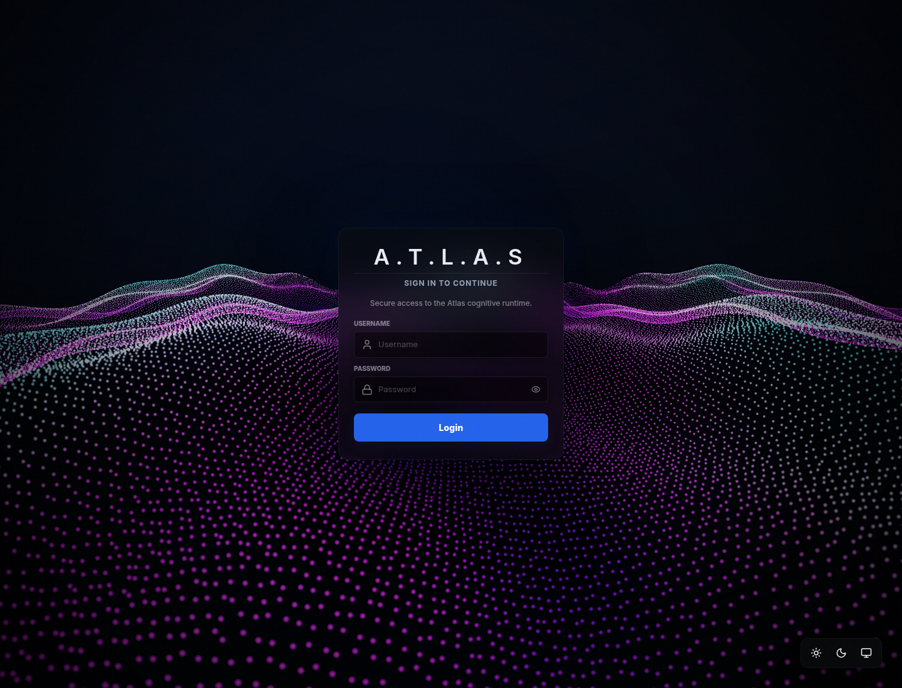

# Assistant-OS

<p align="center">
  
</p>

<p align="center">
  <strong>Atlas is the assistant experience.</strong><br>
  Assistant-OS is the runtime that keeps it fast, memoryful, and safe to operate.
</p>

<p align="center">
  <a href="#meet-atlas">Meet Atlas</a> ·
  <a href="#what-it-does">What it does</a> ·
  <a href="#why-it-feels-different">Why it feels different</a> ·
  <a href="#see-it">See it</a> ·
  <a href="#get-started">Get started</a>
</p>

<p align="center">
  
</p>

## Meet Atlas

Atlas is the assistant layer you interact with day to day. It is designed to feel present, persistent, and useful across sessions instead of restarting from zero every time.

Assistant-OS powers that experience behind the scenes.

## What it does

Atlas is built to:

- help you move from intent to action without losing context;
- remember sessions, thoughts, feedback, and playback traces;
- work across web, voice, Telegram, and CLI;
- keep execution guarded by permissions and session contracts;
- make the system easier to trust, debug, and extend.

## Why it feels different

Most assistant experiences fail in the same places: they forget what happened, they mix up conversation with execution, and they are hard to inspect when something goes wrong.

Atlas aims to avoid that by keeping the runtime explicit:

- the session is canonical;
- the event log is coherent;
- the UI can reload from a snapshot;
- voice and text share the same underlying flow;
- feedback and reasoning stay visible as part of the timeline.

That makes the product feel less like a chat box and more like an assistant workspace.

## What you can do

- talk to Atlas through the web app;
- move between text and voice without losing the thread;
- inspect conversation history, thoughts, and playback;
- let Atlas coordinate capabilities like browser, calendar, memory, and system actions;
- rely on a safer execution model instead of ad hoc prompts.

## See it

<p align="center">
  
</p>

This is what Atlas looks like in the app:

- a focused login entry;
- a dark, high-contrast visual style;
- a product surface that feels closer to an operating console than a generic chatbot.

## Under the hood

The repo is organized around a few stable layers:

- `src/core/` for orchestration, session flow, ACL, and intent resolution
- `src/server/` for the API and route layer
- `src/capabilities/` for modular actions
- `frontend/` for the React web panel
- `docs/` for the human-readable history and design notes

## Get started

### 1. Create a virtual environment

```bash
python -m venv env
```

### 2. Install dependencies

```bash
./env/bin/pip install -r requirements.txt
```

### 3. Configure the runtime

- main file: `data/config.json`
- example baseline: `config.json.example`

### 4. Run the backend API

```bash
PYTHONPATH=src ./env/bin/python -m uvicorn src.server.main:create_app --factory --host 0.0.0.0 --port 8000
```

### 5. Run the frontend

```bash
cd frontend
npm install
npm run dev
```

### 6. Run tests

```bash
PYTHONPATH=src ./env/bin/python -m pytest -q tests
```

## In practice

The current work in this repository is centered on:

- canonical session snapshots;
- live event reconciliation;
- thought and reasoning timelines;
- voice transcript and playback flow;
- feedback persistence;
- capability contracts and test coverage.

That keeps Atlas easier to trust, easier to extend, and easier to debug when multiple drivers are active at once.

## For builders

If you are building on the project:

1. Read [`AGENTS.md`](AGENTS.md) for the workspace convention.
2. Continue with [`project.overview.md`](project.overview.md).
3. Then open [`agent-start-here.md`](agent-start-here.md).

For update workflows, also read:

- [`project.update.md`](project.update.md)
- [`project.migrations.md`](project.migrations.md)

## Scripts

- `scripts/test_bridge.py`: CLI bridge for manual flow testing
- `scripts/validate_agent.py`: guided manual validation suite

## License

BSD 3-Clause. See [`LICENSE`](LICENSE).
