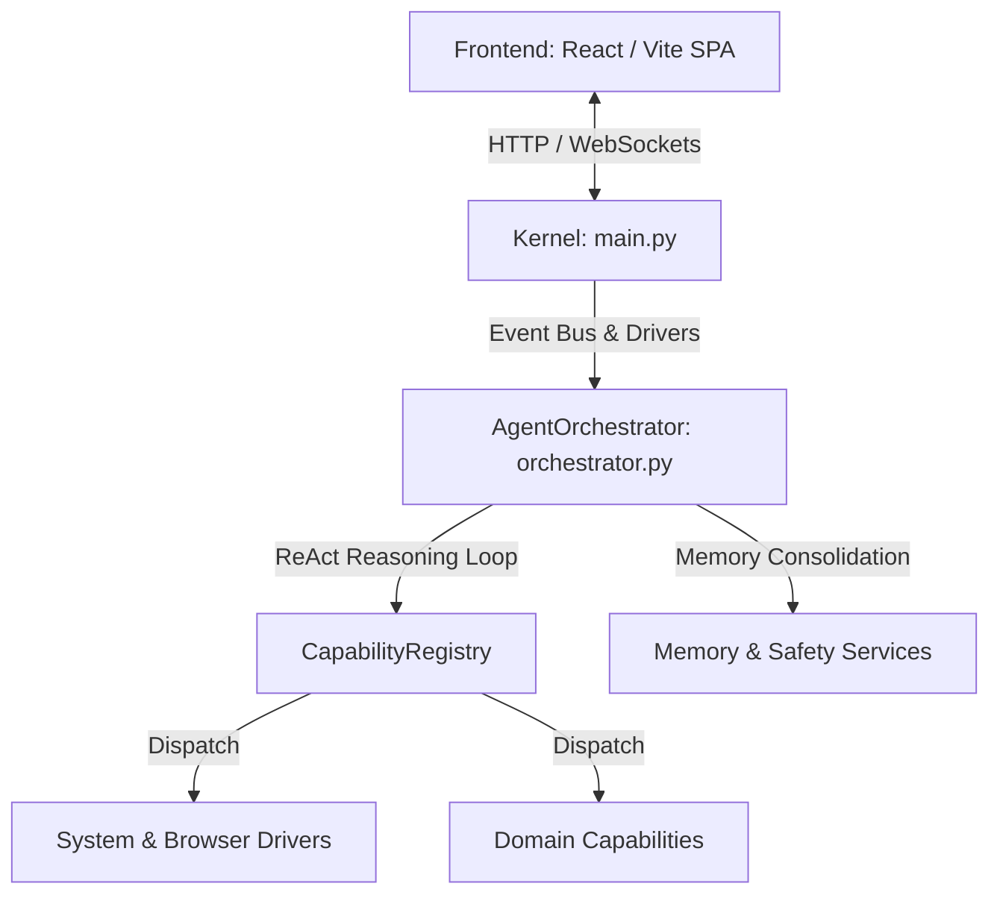

# Analise Tecnica Profunda e Relatorio de Auditoria: Assistant-OS

> Documento historico. Esta analise descreve uma fase anterior da arquitetura e nao representa o contrato ativo atual.

Este documento apresenta uma analise tecnica minuciosa da arquitetura, implementacao e design do sistema **Assistant-OS**, cobrindo o backend em Python (Kernel, Orchestrator, Drivers, Capabilities) e o frontend em React (Vite, TailwindCSS).

---

## 1. Visao Geral da Arquitetura

O **Assistant-OS** funciona como um sistema operacional e ecossistema de orquestracao de agentes autonomos baseados em LLMs. A arquitetura divide-se nas seguintes camadas principais:



### 1.1. Camada de Bootstrap e Roteamento (`src/main.py`)
O `Kernel` atua como o ponto central de inicializacao e roteamento de eventos. Ele instancia e gerencia os drivers de interface (`VoiceDriver`, `TelegramDriver`, `ServerDriver`, `SystemDriver`), o barramento assincrono de eventos (`queue.Queue`), o escalonador de tarefas (`Scheduler`) e o gerenciador de sub-agentes (`WorkerManager`). O metodo `process_input` cria instancias de trabalho (`Work`) e despacha a execucao assincrona.

### 1.2. Motor de Orquestracao Cognitiva (`src/core/orchestrator.py`)
O `AgentOrchestrator` e o coracao cognitivo do sistema. Operando no padrao Singleton, ele coordena o loop de raciocinio do agente (ReAct: Reason -> Act -> Observe), valida planos de acao via `PlanValidator`, avalia politicas de guardrails de falha e de repeticao via `SupervisorPolicy` e faz a gestao da memoria episodica e de conversacao (com mecanismos de consolidacao e compressao baseados em contagem de tokens).

### 1.3. Sistema de Capabilities e Contratos (`src/capabilities/`)
O `CapabilityRegistry` gerencia as capacidades disponiveis, utilizando uma forte validacao de contratos estruturados (`CapabilityContractV1`). Ele aplica algoritmos de pontuacao lexica e similaridade (`difflib`) para resolver identificadores de acoes e oferecer sugestoes dinamicas diante de ambiguidades.

### 1.4. Frontend React SPA (`frontend/src/`)
Desenvolvido em React com Vite e TailwindCSS, o frontend se comunica via REST/WebSocket com o backend. O grande destaque e o componente `WorkUnitInspector`, que oferece transparencia granular do ciclo de raciocinio da IA, apresentando abas para o Plano, Pensamento, Terminal, Logs, Capabilities, Midia e Fontes.

---

## 2. Pontos Positivos e Boas Praticas

O sistema apresenta conceitos arquiteturais modernos e de ponta na area de Engenharia de Agentes Autonomos:

1. **Loop ReAct Autonomo e Resiliente (`process` em `orchestrator.py`)**:
   - Implementacao de um ciclo de raciocinio robusto com limite dinamico de passos (`max_steps`).
   - Mecanismo de replanejamento com orcamento controlado (`replan_budget`), permitindo que a IA ajuste estrategias em tempo de execucao sem entrar em loops infinitos.

2. **Guardrails Cognitivos e Quarentena de Acoes**:
   - O sistema rastreia repeticoes de acoes e falhas identicas sucessivas. Ao atingir o limiar (ex: 3 falhas ou repeticoes em 5 passos), o `SupervisorPolicy` interrompe o ciclo ou entra em modo de recuperacao conversacional.
   - **Quarentena (Cooldowns)**: Acoes instaveis (como controle de navegador) recebem um bloqueio temporario (cooldown de 2 turnos) em caso de falha critica, impedindo que o planejador insista em chamadas defeituosas.

3. **Governanca de IA e Seguranca (Human-in-the-Loop)**:
   - Acoes sensiveis ou destrutivas sao inspecionadas pelo `SafetyService` e `AccessController`. Se o usuario nao tiver concedido permissao previa, a execucao pausa automaticamente (`WAITING_USER`) e solicita aprovacao explicita (Sim/Nao) no canal apropriado antes de prosseguir.

4. **Gerenciamento Avancado de Memoria**:
   - Para evitar que o contexto do LLM estoure, o orquestrador realiza o calculo continuo de tokens. Se o limite for excedido, aciona a consolidacao e compressao da memoria (sumarizacao de saidas longas).
   - O historico de raciocinio interno (`thought`, `plan`) e separado do historico de dialogos visiveis para o usuario final, mantendo a interface limpa e profissional.

---

## 3. Falhas Criticas, Bugs e Erros de Logica Encontrados

Durante a inspecao profunda do codigo, foram identificadas falhas graves de execucao, codigo morto e vulnerabilidades de escopo de variaveis:

### 3.1. Codigo Morto e Erros de Escopo (`NameError`) em `src/main.py`
No metodo `_send_to_session`, as linhas **500 a 522** contem um bloco de tratamento de erro e emissao de eventos que nunca sera alcançado, pois esta localizado **apos** as instrucoes de retorno da funcao (`return True` e `except ... return False`).

Ale de ser codigo inalcalcavel (dead code), se o interpretador chegasse a esse trecho, ocorreria uma excecao fatal do tipo **`NameError`**:
```python
# Trecho defeituoso em src/main.py (linhas 500-522):
logger.error(f"Target session {owner_session_id} not found for worker approval prompt. Target missing.")
global_event_bus.emit_threadsafe({
    "type": "error",
    "work_id": work_id, ...
})
```
* **O Problema**: As variaveis `owner_session_id`, `work_id` e `prompt` referenciadas no bloco **nao sao parametros** e **nao estao definidas** no escopo de `_send_to_session`.

### 3.2. Variavel Indefinida no Roteamento (`process_input` em `src/main.py`)
Na linha **1197**, na construcao do dicionario para a confirmacao de takeover (`confirm_takeover`), o codigo tenta acessar a variavel `model_used`:
```python
"model_used": model_used
```
* **O Problema**: Em varios fluxos de execucao antes dessa chamada, a variavel `model_used` nao esta inicializada no escopo local, podendo causar falhas na transicao de sessao.

### 3.3. O "God Object" Monolitico (`AgentOrchestrator`)
O arquivo `src/core/orchestrator.py` possui mais de **7.000 linhas** (~340KB). A classe `AgentOrchestrator` acumula responsabilidades excessivas:
- Instanciacao de mais de 25 servicos de dominio.
- Gerenciamento de concorrencia e RLock.
- Manipulacao direta de AST de planos e padronizacao de caminhos de arquivos e midias.
- Sincronizacao de calendarios (Google Calendar) e gestao de threads de Garbage Collection.
* **O Risco**: Altissimo acoplamento. Qualquer modificacao em um servico ou driver exige mexer na classe central, aumentando o risco de regressoes e dificultando a escrita de testes unitarios.

### 3.4. Riscos de Concorrencia e Gargalos de Lock (`threading.RLock`)
O sistema gerencia o estado da sessao com locks reentrantes (`_get_or_create_session_lock`) e aplica um timeout de bloqueio longo (120 segundos na linha 1775 de `orchestrator.py`).
* **O Risco**: Em tarefas longas de LLM ou chamadas de automacao web, o bloqueio prolongado da sessao impede que eventos rapidos (como comandos de pausa/cancelamento ou atualizacoes de background) sejam processados com baixa latencia, gerando enfileiramento excessivo e potenciais timeouts em cascata.

### 3.5. Componentes Monoliticos no Frontend (`Chat.jsx`)
O arquivo `frontend/src/pages/Chat.jsx` tem **4.500 linhas** (231KB). Ele mistura toda a logica de roteamento de WebSockets, renderizacao de Markdown em tempo real (Typewriter), agrupamento de timeline de raciocinio (`groupHistoryWithReasoning`) e multiplos dialogos modais.

---

## 4. Recomendações e Plano de Refatoração

Para elevar a robustez e manutenibilidade do **Assistant-OS** a um padrao de excelencia de software corporativo, recomenda-se o seguinte plano de acao:

### 4.1. Correcao Imediata dos Bugs no Kernel (`src/main.py`)
- **Remover ou corrigir o trecho de codigo morto** em `_send_to_session`. Se a intencao era emitir erro quando a sessao falha, o bloco deve ser movido para dentro do bloco `except` ou da validacao inicial, garantindo que as variaveis necessarias (`owner_session_id`, `work_id`) sejam passadas como parametros opcionais.
- **Inicializar variaveis de escopo** em `process_input` (como `model_used = None` no topo do metodo) para evitar falhas de NameError em tempo de execucao.

### 4.2. Desacoplamento do God Object (`AgentOrchestrator`)
- **Extrair Servicos Independentes**: Separar as logicas auxiliares em classes especificas. Por exemplo:
  - `CognitiveExecutionEngine`: Dedicada exclusivamente ao loop ReAct e avaliacao de planos.
  - `SessionLifecycleManager`: Gerenciamento de criacao, persistencia, locks e expiracao de sessoes.
  - `MediaAttachmentProcessor`: Padronizacao de caminhos e gestao de arquivos de midia.
- **Inversao de Controle (IoC)**: Em vez de o `AgentOrchestrator` instanciar tudo manualmente no `__init__`, utilizar um container de injeção de dependencias ou registrar os servicos no `Kernel`.

### 4.3. Otimizacao da Concorrencia e Gestao de Filas
- **Granularidade de Locks**: Em vez de travar a sessao inteira durante toda a chamada de rede ao LLM, liberar o lock (`lock.release()`) antes da requisicao HTTP de inferencia e readquiri-lo apenas no momento de atualizar o estado e o historico da sessao.
- **Event-Driven Architecture**: Reforcar o uso do `global_event_bus` para sinalizacoes assincronas (como cancelamentos e pausas), permitindo interrupcoes imediatas de workers sem aguardar o destravamento do RLock principal.

### 4.4. Refatoracao do Frontend React
- **Modularizacao de Componentes**: Quebrar o arquivo `Chat.jsx` em componentes menores e dedicados:
  - `InspectorPanel/`: Contendo o `WorkUnitInspector` e as sub-abas.
  - `MessageTimeline/`: Focado na renderizacao de mensagens e do Typewriter Markdown.
- **Extracao de Logica de Negocio**: Mover funcoes puras de manipulacao e agrupamento de dados (como `groupHistoryWithReasoning` e `normalizeReasoningTimeline`) para utilitarios dentro de `frontend/src/utils/historyTransform.js`, permitindo testes unitarios no JS/TS.

---

## 5. Conclusao

O **Assistant-OS** possui uma arquitetura conceitual brilhante, com mecanismos avancados de raciocinio, guardrails cognitivos e transparencia visual de alta qualidade. As correcoes pontuais de escopo no `main.py` e o desacoplamento progressivo do orquestrador garantirao que o sistema opere com extrema estabilidade, escalabilidade e velocidade em ambientes de producao.
