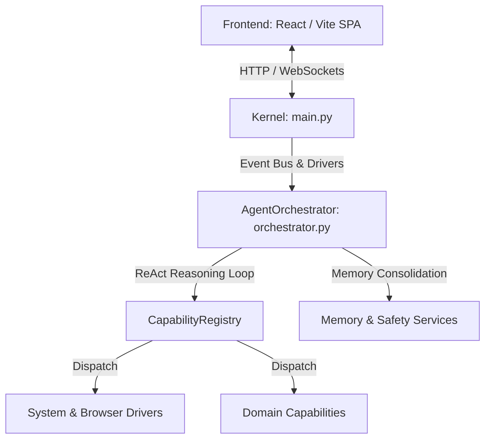

# Análise Técnica Profunda e Relatório de Auditoria: Assistant-OS

Este documento apresenta uma análise técnica minuciosa da arquitetura, implementação e design do sistema **Assistant-OS**, cobrindo o backend em Python (Kernel, Orchestrator, Drivers, Capabilities) e o frontend em React (Vite, TailwindCSS).

---

## 1. Visão Geral da Arquitetura

O **Assistant-OS** funciona como um sistema operacional e ecossistema de orquestração de agentes autônomos baseados em LLMs. A arquitetura divide-se nas seguintes camadas principais:



### 1.1. Camada de Bootstrap e Roteamento (`src/main.py`)
O `Kernel` atua como o ponto central de inicialização e roteamento de eventos. Ele instancia e gerencia os drivers de interface (`VoiceDriver`, `TelegramDriver`, `ServerDriver`, `SystemDriver`), o barramento assíncrono de eventos (`queue.Queue`), o escalonador de tarefas (`Scheduler`) e o gerenciador de sub-agentes (`WorkerManager`). O método `process_input` cria instâncias de trabalho (`Work`) e despacha a execução assíncrona.

### 1.2. Motor de Orquestração Cognitiva (`src/core/orchestrator.py`)
O `AgentOrchestrator` é o coração cognitivo do sistema. Operando no padrão Singleton, ele coordena o loop de raciocínio do agente (ReAct: Reason -> Act -> Observe), valida planos de ação via `PlanValidator`, avalia políticas de guardrails de falha e de repetição via `SupervisorPolicy` e faz a gestão da memória episódica e de conversação (com mecanismos de consolidação e compressão baseados em contagem de tokens).

### 1.3. Sistema de Capabilities e Contratos (`src/capabilities/`)
O `CapabilityRegistry` gerencia as capacidades disponíveis, utilizando uma forte validação de contratos estruturados (`CapabilityContractV1`). Ele aplica algoritmos de pontuação léxica e similaridade (`difflib`) para resolver identificadores de ações e oferecer sugestões dinâmicas diante de ambiguidades.

### 1.4. Frontend React SPA (`frontend/src/`)
Desenvolvido em React com Vite e TailwindCSS, o frontend se comunica via REST/WebSocket com o backend. O grande destaque é o componente `WorkUnitInspector`, que oferece transparência granular do ciclo de raciocínio da IA, apresentando abas para o Plano, Pensamento, Terminal, Logs, Capabilities, Mídia e Fontes.

---

## 2. Pontos Positivos e Boas Práticas

O sistema apresenta conceitos arquiteturais modernos e de ponta na área de Engenharia de Agentes Autônomos:

1. **Loop ReAct Autônomo e Resiliente (`process` em `orchestrator.py`)**:
   - Implementação de um ciclo de raciocínio robusto com limite dinâmico de passos (`max_steps`).
   - Mecanismo de replanejamento com orçamento controlado (`replan_budget`), permitindo que a IA ajuste estratégias em tempo de execução sem entrar em loops infinitos.

2. **Guardrails Cognitivos e Quarentena de Ações**:
   - O sistema rastreia repetições de ações e falhas idênticas sucessivas. Ao atingir o limiar (ex: 3 falhas ou repetições em 5 passos), o `SupervisorPolicy` interrompe o ciclo ou entra em modo de recuperação conversacional.
   - **Quarentena (Cooldowns)**: Ações instáveis (como controle de navegador) recebem um bloqueio temporário (cooldown de 2 turnos) em caso de falha crítica, impedindo que o planejador insista em chamadas defeituosas.

3. **Governança de IA e Segurança (Human-in-the-Loop)**:
   - Ações sensíveis ou destrutivas são inspecionadas pelo `SafetyService` e `AccessController`. Se o usuário não tiver concedido permissão prévia, a execução pausa automaticamente (`WAITING_USER`) e solicita aprovação explícita (Sim/Não) no canal apropriado antes de prosseguir.

4. **Gerenciamento Avançado de Memória**:
   - Para evitar que o contexto do LLM estoure, o orquestrador realiza o cálculo contínuo de tokens. Se o limite for excedido, aciona a consolidação e compressão da memória (sumarização de saídas longas).
   - O histórico de raciocínio interno (`thought`, `plan`) é separado do histórico de diálogos visíveis para o usuário final, mantendo a interface limpa e profissional.

---

## 3. Falhas Críticas, Bugs e Erros de Lógica Encontrados

Durante a inspeção profunda do código, foram identificadas falhas graves de execução, código morto e vulnerabilidades de escopo de variáveis:

### 3.1. Código Morto e Erros de Escopo (`NameError`) em `src/main.py`
No método `_send_to_session`, as linhas **500 a 522** contêm um bloco de tratamento de erro e emissão de eventos que nunca será alcançado, pois está localizado **após** as instruções de retorno da função (`return True` e `except ... return False`).

Além de ser código inalcançável (dead code), se o interpretador chegasse a esse trecho, ocorreria uma exceção fatal do tipo **`NameError`**:
```python
# Trecho defeituoso em src/main.py (linhas 500-522):
logger.error(f"Target session {owner_session_id} not found for worker approval prompt. Target missing.")
global_event_bus.emit_threadsafe({
    "type": "error",
    "work_id": work_id, ...
})
```
* **O Problema**: As variáveis `owner_session_id`, `work_id` e `prompt` referenciadas no bloco **não são parâmetros** e **não estão definidas** no escopo de `_send_to_session`.

### 3.2. Variável Indefinida no Roteamento (`process_input` em `src/main.py`)
Na linha **1197**, na construção do dicionário para a confirmação de takeover (`confirm_takeover`), o código tenta acessar a variável `model_used`:
```python
"model_used": model_used
```
* **O Problema**: Em vários fluxos de execução antes dessa chamada, a variável `model_used` não está inicializada no escopo local, podendo causar falhas na transição de sessão.

### 3.3. O "God Object" Monolítico (`AgentOrchestrator`)
O arquivo `src/core/orchestrator.py` possui mais de **7.000 linhas** (~340KB). A classe `AgentOrchestrator` acumula responsabilidades excessivas:
- Instanciação de mais de 25 serviços de domínio.
- Gerenciamento de concorrência e RLock.
- Manipulação direta de AST de planos e padronização de caminhos de arquivos e mídias.
- Sincronização de calendários (Google Calendar) e gestão de threads de Garbage Collection.
* **O Risco**: Altíssimo acoplamento. Qualquer modificação em um serviço ou driver exige mexer na classe central, aumentando o risco de regressões e dificultando a escrita de testes unitários.

### 3.4. Riscos de Concorrência e Gargalos de Lock (`threading.RLock`)
O sistema gerencia o estado da sessão com locks reentrantes (`_get_or_create_session_lock`) e aplica um timeout de bloqueio longo (120 segundos na linha 1775 de `orchestrator.py`).
* **O Risco**: Em tarefas longas de LLM ou chamadas de automação web, o bloqueio prolongado da sessão impede que eventos rápidos (como comandos de pausa/cancelamento ou atualizações de background) sejam processados com baixa latência, gerando enfileiramento excessivo e potenciais timeouts em cascata.

### 3.5. Componentes Monolíticos no Frontend (`Chat.jsx`)
O arquivo `frontend/src/pages/Chat.jsx` tem **4.500 linhas** (231KB). Ele mistura toda a lógica de roteamento de WebSockets, renderização de Markdown em tempo real (Typewriter), agrupamento de timeline de raciocínio (`groupHistoryWithReasoning`) e múltiplos diálogos modais.

---

## 4. Recomendações e Plano de Refatoração

Para elevar a robustez e manutenibilidade do **Assistant-OS** a um padrão de excelência de software corporativo, recomenda-se o seguinte plano de ação:

### 4.1. Correção Imediata dos Bugs no Kernel (`src/main.py`)
- **Remover ou corrigir o trecho de código morto** em `_send_to_session`. Se a intenção era emitir erro quando a sessão falha, o bloco deve ser movido para dentro do bloco `except` ou da validação inicial, garantindo que as variáveis necessárias (`owner_session_id`, `work_id`) sejam passadas como parâmetros opcionais.
- **Inicializar variáveis de escopo** em `process_input` (como `model_used = None` no topo do método) para evitar falhas de NameError em tempo de execução.

### 4.2. Desacoplamento do God Object (`AgentOrchestrator`)
- **Extrair Serviços Independentes**: Separar as lógicas auxiliares em classes específicas. Por exemplo:
  - `CognitiveExecutionEngine`: Dedicada exclusivamente ao loop ReAct e avaliação de planos.
  - `SessionLifecycleManager`: Gerenciamento de criação, persistência, locks e expiração de sessões.
  - `MediaAttachmentProcessor`: Padronização de caminhos e gestão de arquivos de mídia.
- **Inversão de Controle (IoC)**: Em vez de o `AgentOrchestrator` instanciar tudo manualmente no `__init__`, utilizar um container de injeção de dependências ou registrar os serviços no `Kernel`.

### 4.3. Otimização da Concorrência e Gestão de Filas
- **Granularidade de Locks**: Em vez de travar a sessão inteira durante toda a chamada de rede ao LLM, liberar o lock (`lock.release()`) antes da requisição HTTP de inferência e readquiri-lo apenas no momento de atualizar o estado e o histórico da sessão.
- **Event-Driven Architecture**: Reforçar o uso do `global_event_bus` para sinalizações assíncronas (como cancelamentos e pausas), permitindo interrupções imediatas de workers sem aguardar o destravamento do RLock principal.

### 4.4. Refatoração do Frontend React
- **Modularização de Componentes**: Quebrar o arquivo `Chat.jsx` em componentes menores e dedicados:
  - `InspectorPanel/`: Contendo o `WorkUnitInspector` e as sub-abas.
  - `MessageTimeline/`: Focado na renderização de mensagens e do Typewriter Markdown.
- **Extração de Lógica de Negócio**: Mover funções puras de manipulação e agrupamento de dados (como `groupHistoryWithReasoning` e `normalizeReasoningTimeline`) para utilitários dentro de `frontend/src/utils/historyTransform.js`, permitindo testes unitários no JS/TS.

---

## 5. Conclusão

O **Assistant-OS** possui uma arquitetura conceitual brilhante, com mecanismos avançados de raciocínio, guardrails cognitivos e transparência visual de alta qualidade. As correções pontuais de escopo no `main.py` e o desacoplamento progressivo do orquestrador garantirão que o sistema opere com extrema estabilidade, escalabilidade e velocidade em ambientes de produção.
